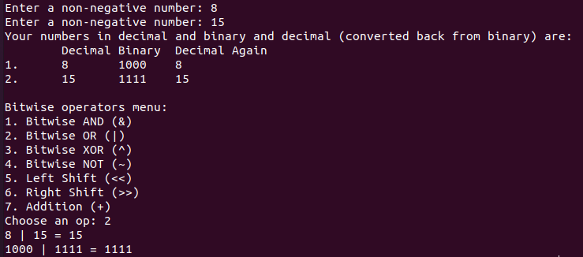

# Homework 2 (400 points, due 03/08/2024 11:59 PM)
We will continue modifying the `int2bin.cpp` file from class (although we won't use the same name) to build a more 
useful application that works on 4-bit integers. 
Our application will model 4-bit integers in decimal using C++ integers and in binary using C-style arrays of Booleans.
It will be able to demonstrate the behaviors of some of C++'s operators on our 4-bit integers. Moreover, since we have 
a binary representation, we can see the results of the operators at both the bit level and the integer level. We 
will work only with unsigned 4-bit integers and model the operators bitwise AND (`&`), bitwise OR (`|`), bitwise XOR (`^`),
bitwise NOT (`~`), left shift (`<<`), right shift (`>>`), and addition (`+`).

You will incrementally add code so that the application performs all of the functionality mentioned above. You will 
notice that the code here has already been modified a little bit from the last version of `int2bin` that we saw in class.
- First, some of the function names have been changed so that we have a consistent naming convention through the program. 
- The function `inttobin` is now called `dec2Bin`. Furthermore, the order of indices stored in the array has been reversed. Now, the least significant bit is stored at index `3` and the most significant bit at index `0` of the array. This makes 
conversion from binary to decimal more straightforward. However, bit shifting might be counterintuitive, but we have to pick some convention and we'll fix this one.
- We input 2 integers from the user, and the input taking code has been moved to `inputInt`.
- Similarly, the code to print our binary values has been moved from `printBin`.

## Submission Instructions
Submit **only** the solution files - files where you will enter your solutions - via ICON. For this assignment, 
these are `prob1.cpp`, `prob2.cpp`, `prob3.cpp` after you have extended them as specified by this homework

**Don't** change the already completed code in the C++ files, and don't change the functional structure of the program 
(for example, don't take the code from a function and put it in main).

For now you are using Git only 
to *pull* from the repository that I'm maintaining. You're not *pushing* changes/solutions to it. Instead, you will submit your solutions in ICON.

**Don't** submit the *specification files* - any files that are used only to specify the problem to you (like 
`README.md`).

You will have to compile C++ code to build executables so you can test your programs, but **don't** submit these executables.

**The following instruction is very important to follow throughout the semester for this class, and through 
your programming career.**
Your solutions must provide **only** what is asked for, nothing less (this isn't a new idea, if your answer contains 
less than what is asked for then you lose points), but also *nothing more* - I want to stress this, you could lose 
points for saying more than what is asked for, including leading or trailing whitespaces. This is because we often 
use automated scripts to grade your solutions, and we have to tell these scripts exactly what to expect from your
solutions. This is analogous to programming in the real world where programs will generate data that are used by 
other programs that don't think like humans, they need to understand the precise form of the data, and can't 
account for even small variations such as unexcepted white-spaces.
Now, sometimes what is asked for is not clear. In this case, your problem is underspecified, so it is not clear 
what to do. In such cases, (and even in cases where the problem is correctly specified but unclear to you) 
you must ask clarifying questions. Please do this on Slack in the channel corresponding to the assignment (#hw2), 
or during office hours.

## Additional Instructions/Advice
1. **Don't** change the code in the completed functions, and don't change the underlying types. 
You might have better ways to do some of the tasks here, but often you need to finish your coding task on one 
part of a development without changing other parts.
2. Your code must compile. This is a programming class so you're not going to get too many points for code that 
doesn't compile even if you have some logic figured out. So if you have only understood some of the logic, make sure
you make it compile so that you can get points for it.
3. Remember that we are using C-style arrays and that when passed by value, these arrays *decay* to behave 
like they were passed by reference. However, the caller only has access to the array and not its length,
so the length of the array must be passed around along with the array itself. **Only** pass arrays this 
way between functions.
4. The following problems are incremental, so you will have to repeat some work. You will have to add your code from
problem 1, to the solutions of problem 2 and 3, and the solutions of problem 2 to problem 3. While you wont get 
addition points for this, you will lose points if you don't do this correctly, so please be careful.

## Problem 1 (for 60 points)
Add your code to `prob1.cpp`. In the `main` function, we input 2 integers in decimal, convert them to binary and 
then back to decimal and print all
3 values to check that our decimal to binary and binary to decimal functions work as they should. Complete the
definition of the `bin2dec` function so that it converts a 4-bit binary integer represented as an array of Booleans
into an `int` and returns it. Figure out what arguments need to be passed to the function so that it has access
to the array. You will need to add the function definition (along with the header for arguments), and any arguments you
add should be reflected in the function prototype on top, and in the function calls from `main`.

To implement the binary to decimal logic, you will need to compute powers of `2`. Don't use the `pow` function
from the `cmath` library with type conversion. Instead, complete the definition of `exp2` that given integer `m`,
returns `2^m`.

Expected output on sample input:

## Problem 2 (for 20 points)
Now we'll call a function called `menu` that will offer a menu of operations to perform on our inputs. `menu` will 
need both inputs in decimal and binary to perform its operations and print a comprehensive output. So pass to `menu`, both
`dec1` and `dec2`, and all the information it will need to work on their binary versions. Print a menu of
7 possible operators, have the user select an option and keep asking till they select something
in range. The expected output for a sample sequence of inputs is shown as follows.

## Problem 3
Now we are ready to define and call the functions for each menu option. Each function will input the decimal and binary 
versions of the inputs they need, perform the corresponding operation on them, and print the results in both 
binary and decimal. Don't perform any operations on the decimal value, simply use the `bin2Dec` function to print the 
decimal version of the result (and we're already passing the decimal version of the input to the function).

- `bAndBin` (for 40 points)
Perform bitwise AND on the 4-bit binary numbers. Sample output:

- `bOrBin` (for 40 points)
Perform bitwise OR on the 4-bit binary numbers. Sample output:

- `bXorBin` (for 40 points)
Perform bitwise XOR on the 4-bit binary numbers. Sample output:

- `bNotBin` (for 40 points)
Since this is a unary operator, have the user select one of the two inputs to perform the operator on (`1` for the first
and `2` for the second). Keep asking for an input until the user enters a valid choice, and perform bitwise NOT on 
the selected operand. Sample output:

- `lShiftBin` (for 40 points)
Perform left shift on the 4-bit binary numbers. You will need the decimal value of the second value to figure out how
many times to shift the bits in the first one. Feel free to use the decimal argument passed to the function. Sample output:

- `rShiftBin` (for 40 points)
Perform right shift on the 4-bit binary numbers. You will need the decimal value of the second value to figure out how
many times to shift the bits in the first one. Feel free to use the decimal argument passed to the function. Sample output:

- `bAddBin` (for 80 points)
    Perform binary addition on the 4-bit binary numbers. Don't perform decimal addition and then converbXORt the result. You need to perform binary addition and you can convert the result back to decimal. Sample output:
    
    
    I gave the general advice in class of avoiding implicit conversions between types in C++, but for this task
    of implementing binary addition, its okay to  make an exception and use implicit type conversions from bool to int (`true` is converted to `1` and `false` to `0`). Note that while this is not necessary, it might make your logic simpler.
