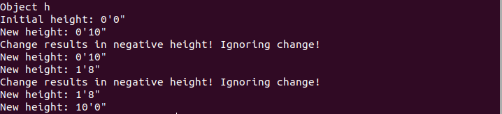
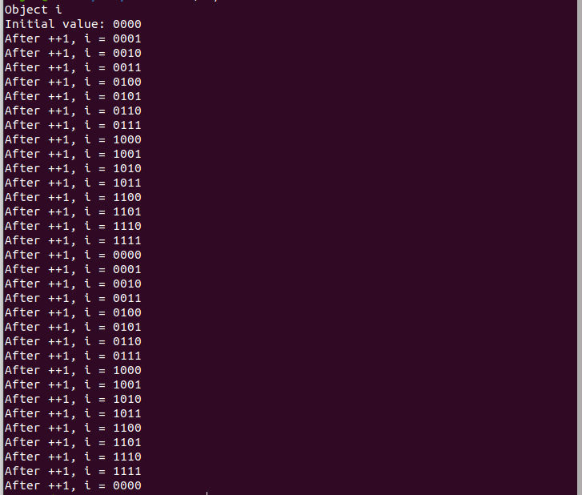
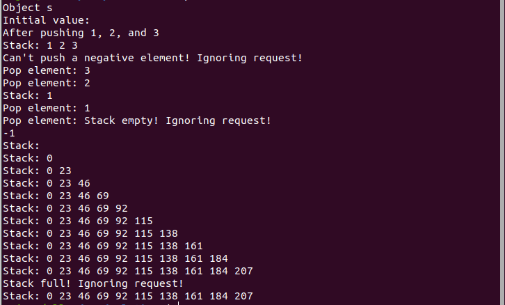
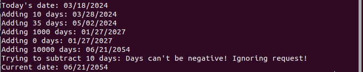

# Homework 3 (200 points, due 03/27/2024 1:00 PM)

## Submission Instructions
Submit **only** the solution files - files where you will enter your solutions - via ICON. For this assignment, 
these are `prob1.cpp`, `prob2.cpp`, `prob3.cpp`, `prob4.cpp` after you have extended them as specified by this homework.

**Don't** change the already completed code in the C++ files, and don't change the functional structure of the program 
(for example, don't take the code from a function and put it in `main`).

For now you are using Git only 
to *pull* from the repository that I'm maintaining. You're not *pushing* changes/solutions to it. Instead, you will submit your solutions in ICON. If you submit the same file multiple times, ICON will rename them with a numeral suffix. This 
is okay.

**Don't** submit the *specification files* - any files that are used only to specify the problem to you (like 
`README.md`).

You will have to compile C++ code to build executables so that you can test your programs, but **don't** submit these executables.

**The following instruction is very important to follow throughout the semester for this class, and through 
your programming career.**
Your solutions must provide **only** what is asked for, nothing less (this isn't a new idea, if your answer contains 
less than what is asked for then you lose points), but also *nothing more* - I want to stress this, you could lose 
points for saying more than what is asked for, including leading or trailing whitespaces. One reason for this is that we may 
use automated scripts to grade your solutions, and we have to tell these scripts exactly what to expect from your
solutions. This is analogous to programming in the real world where programs will generate data that are used by 
other programs that don't think like humans, they need to understand the precise form of the data, and can't 
account for even small variations such as unexcepted white-spaces.
Now, sometimes what is asked for is not clear. In this case, your problem is underspecified, so it is not clear 
what to do. In such cases, (and even in cases where the problem is correctly specified but unclear to you) 
you must ask clarifying questions. Please do this on Slack in the channel corresponding to the assignment (#hw3), 
or during office hours.

## Additional Instructions
Your code must compile. This is a programming class so you're not going to get too many points for code that 
doesn't compile even if you have some logic figured out. So if you have only understood some of the logic, make sure
you make it compile so that you can get points for it.

You will have to figure out the argument type and return types of some of the functions. Use this rule of thumb: if
a simpler type suffices as an argument/return type, don't use a more complicated type. For example, if `void` suffices, as 
a return type, don't use a non-void return type (unless the specification mentions that you need a non-void type).

You will have to figure out the access levels for your class members. Rule of thumb: hide member variables when possible; 
hide internal implementation functions that don't need to be seen from outside the class; expose only interface functions.

The expected output represents only a few specific tests for which your code should work. You need to implement the logic
specified in this document, not hardcode for the cases mentioned in the tests. The tests are commented out in the `main`
function of each file. Once you implement the class and the necessary code, uncomment the tests to test it on your code.
Leave this code uncommented in your submission. You will want to add other tests, but make sure you remove them.

## Problem 1 (for 40 points)
Define a class `Height` to represent height in feet (and inches). `Height` will have two member variables, 
`m_inches` and `m_feet` of type `int`. Both member variables must be directly inaccessible from outside the class. 
Moreover, `feet` will be (directly or indirectly) inaccessible from outside the class. 
Define the following member functions:
- `setHeight` can only set the height of an object to `0`.
- `printHeight` prints the current height of the object as `f'i"` where `f` is the number of feet and `i` the number of 
  inches. You will need to figure out how to print the `"` on to the screen for this.
- `changeHeight(int inches)` can change the height by adding `inches` to it. Notice that `inches` can be negative.
   You need to encode the logic in this function so that:
    1. The function maintains the invariant that the height can never be less than `0`. If an operation results in 
       negative height, print this message onto `cerr` and ignore the operation:
       "Change results in negative height! Ignoring change!\n"
    2. The height is stored in feet (and inches), even though the it can only be incremented/decremented by inches

Expected output after uncommenting code in `main`:

## Problem 2 (for 40 points)
Define a class `Bin4` with one member variable `m_bits` which is a C-style array of length 4. This will represent binary 
numbers as we're used to working with from homework 2. Specifically, the LSB (least significant bit) is stored at index 
0 and the MSB at index 3 of the array. So the decimal number `14` is represented as the array `{false, true, true, true}`
(`m_bits[0]` is `false` and `m_bits[3]` is `true`).
`m_bits` should be directly inacessible from outside the class.
Define the following member functions:
- `setBin` can only set `m_bits` to `0000` (note that C-style arrays don't support direct assignment)
- `printBin` will print the number in binary (from MSB on the left to LSB on the right. ex: `14` will be printed as `1110`).
- `incrBin` will increment `m_bits` by `1`.

Notice that you don't need any conversion between decimal and binary. Feel free to borrow any code that you would like from
homework 2.

Expected output after uncommenting code in `main`:

## Problem 3 (for 40 points)
Define a class `Stack`, representing a fixed-size (10 element) stack of natural numbers (non-negative integers). 
`Stack` will have one member variable `m_data`, a C-style array of integers of length 10. This will be directly inacessible from outside the class. This array will simulate a stack data structure (note that this is a first-in, first-out data
structure). We will represent empty elements using `-1` (this is an internal implementation detail, a user of the class doesn't
need to know this).
Define the following member functions:
- `setStack` can only set all elements of `m_data` to `-1` representing an empty stack.
- `printStack` will print all stack elements as space separated values.
- `push(int el)` will push element `el` onto the stack (stack increases from index `0` of the array to index `9`). 
   Special cases:
    1. If `el` is negative, print this message onto `cerr` and ignore the push operation:
        "Can't push a negative element! Ignoring request!\n"
    2. If the stack is full, print this message onto `cerr` and ignore the push operation:
        "Stack full! Ignoring request!\n"
- `int pop()` will pop the top element off the stack, and return it. If there are no elements on the stack
    print this message onto `cerr` and ignore the pop operation (have it return `-1` as default behavior):
    "Stack empty! Ignoring request!\n"

Expected output after uncommenting code in `main`:

## Problem 4 (for 80 points)
Define a class `Date`, representing a date using the following private member variables:
integers `m_day` and `m_year`; and `m_month` of enumerative type `Month` to represent the possible months in the year.
Notice that `Month` is an implementation detail of the class, a user of the class doesn't need to know how the month logic
is implemented by the class to use its interface functions (below).
Define the following member functions:
- `setDate` can only set the date to `03/18/2024`.
- `printDate` will print the date in the `MM/DD/YYYY` format. When the month or day can be represented using a single digit,
   they need to be prefixed with a `0` to comply with this format. Easiest way to do this is to find out how to manipulate the 
   `cout` stream to achieve this behavior. 
- `changeDate(int days)` will add `days` to the current date. Special cases:
    1. If `days` is negative, print this message onto `cerr` and ignore the operation:
        "Days can't be negative! Ignoring request!\n"
    2. For simplicity, assume that leap years don't exist, so every year has 365 days and February has 28 days every year.
    3. Ignore integer overflow for the year. That is, if the year reaches the value of maximum possible integer and we try 
       to increment to the next year, undefined behavior will result. But assume that we will not test with such large increments of date (we're doing this for simplicity, but you should be thinking about such corner cases while writing software).

Expected output after uncommenting code in `main`:

